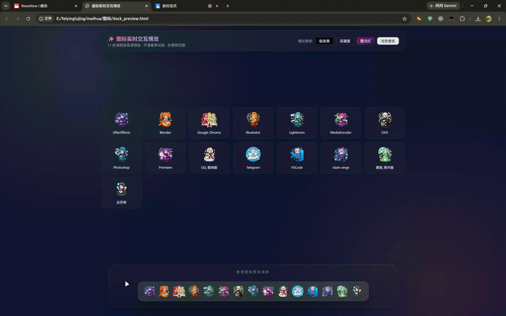
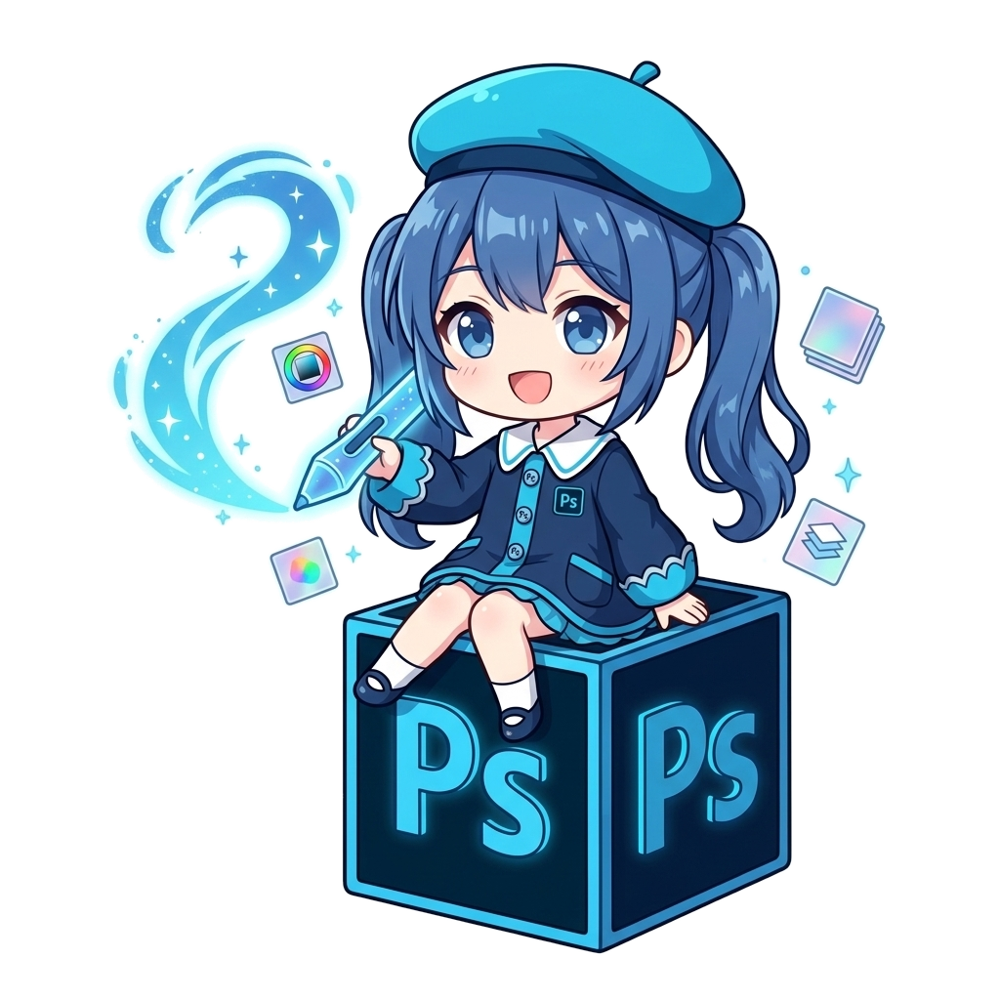
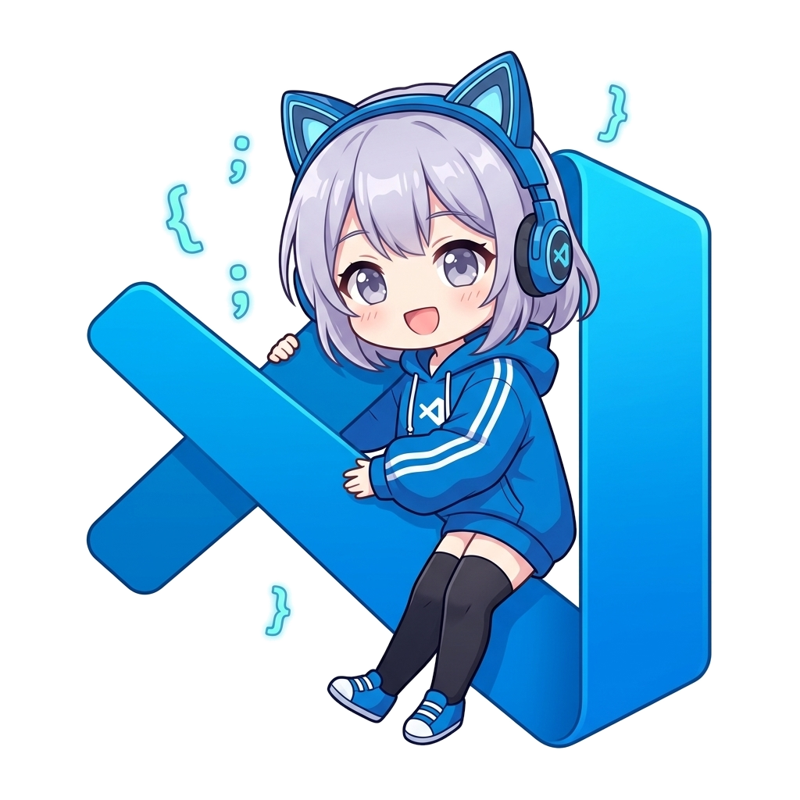

# 🎨 MoeDock 萌坞 · 二次元卡通拟人 Dock 栏图标生产工坊Skill技能

<p align="center">
  
</p>

<p align="center">
  <strong>把常用软件变成有性格的桌面伙伴。</strong><br />
  从透明 PNG 到多尺寸 ICO，再到可交互的 Dock 预览，一套素材与工具即可完成。
</p>

<p align="center">
  
  
  <a href="https://github.com/Love-Neko/MoeDock/actions/workflows/ci.yml"></a>
  <a href="https://github.com/Love-Neko/MoeDock/releases"></a>
  
  <a href="./LICENSE"></a>
</p>

<p align="center">
  <a href="./README.md">简体中文</a> ·
  <a href="./README.en.md">English</a> ·
  <a href="./README.ja.md">日本語</a>
</p>

---

## 📖 什么是 MoeDock？

**MoeDock（萌坞）** 是一套面向桌面 Dock 图标制作 和应用启动器的二次元拟人化图标生产工作流Skill。它将软件品牌的经典颜色、视觉符号与气质转译成极具角色感的二次元萌系图标，同时严格保证小尺寸下清晰、易认、耐看的轮廓辨识度。

项目包含高清透明底 PNG、Windows 原生 256~16px 多层级 ICO、单文件离线交互式网页预览，以及一键抠图、格式封装与自动化生产流水线。你可以直接使用现成的图标包，也可以将本仓库作为 AI 智能体的 **Skill**，随时定制任意专属软件图标！

## ✨ 核心特色

- **品牌色优先（70% 锚定）**：严格提炼官方品牌色作为发色与服饰主色，小图标秒认软件
- **道具拟人化**：将官方 Logo 转译成可互动的 3D 实体装备、坐骑或手持工具
- **纯净透明底**：BFS 抗锯齿边缘羽化，支持内部闭合孔洞透空与可选 2px 贴纸微白边
- **原生多尺寸 ICO**：单文件打包完整封装 16、32、48、64、128、256 px 全部层级
- **本地 macOS 级交互预览**：无需服务环境，双击 HTML 即可体验真实物理悬停放大手感与多壁纸检验
- **一键全自动生产流水线**：单条命令打通 `生图去白底 -> 封装 ICO -> 热刷新预览`

## 🧭 项目结构

```text
MoeDock/
├─ 例图/
│  ├─ PNG图标/          # 高清透明 PNG 素材 (4K / RGBA)
│  └─ ICO图标/          # Windows 256~16px 多层级原生 ICO
├─ dock_preview.html    # 离线单文件交互动效预览台（含实时搜索）
├─ 图标预览.gif         # 效果动态展示
├─ preview.gif          # 英文别名动图
├─ scripts/             # 一键总装管线、去背、转 ICO、更新预览页
│  ├─ pipeline.py       # 🚀 一键端到端全自动总装脚本
│  ├─ remove_bg.py      # 抗锯齿去白底（支持 seeds 与贴纸白边）
│  ├─ convert_ico.py    # 单文件/目录自适应多尺寸 ICO 打包器
│  ├─ update_preview.py # 本地预览页生成器（内置离线样式兜底）
│  └─ build_release.py  # GitHub Release 发布包一键打包工具
├─ references/          # 品牌色卡库 (color_palette.md) 与提示词库
├─ examples/            # 实战工作流指南
└─ tests/               # 自动化回归单元测试集
```

## ⚡ 快速开始

### 1. 获取项目

```bash
git clone https://github.com/Love-Neko/MoeDock.git
cd MoeDock
pip install -r requirements.txt
```

> 💡 **不想运行代码？** 前往 [GitHub Releases](https://github.com/Love-Neko/MoeDock/releases) 页面，可直接下载打包好的所有高清 PNG 与 ICO 图标包！

### 2. 打开交互式预览台

直接在浏览器中双击打开 `dock_preview.html`。页面支持：
* 🎨 **多壁纸切换**：支持极夜黑、深邃紫、霞光红、浅色壁纸实时检查透底与对比度；
* 🔍 **即时搜索过滤**：顶部搜索框秒级定位目标应用；
* 🌊 **macOS 物理悬停**：还原真机级别的鼠标划过平滑缩放动效。

### 3. 一键流水线总装（最简操作推荐）

只要有一张 AI 生成的白底原图，一条命令即可自动完成 **去白底 + 居中方形扩展 + 封装 Windows 6尺寸 ICO + 热刷新预览台**：
制作二次元卡通拟人图标请: 使用 anime-dock-icon 技能，为我的 [软件名] 设计并制作一套二次元卡通 Dock 图标

```bash
python scripts/pipeline.py -i input.jpg -n Steam --png-dir ./例图/PNG图标 --ico-dir ./例图/ICO图标 -p ./dock_preview.html
```

#### 分步精细控制：
```bash
# 1. 去除白底并导出透明 PNG（支持容差与内孔穿透种子点）
python scripts/remove_bg.py -i input.jpg -o output.png --tol 245 --seeds "150,200;300,400" --sticker 2

# 2. 将 PNG 封装为多尺寸 ICO（单文件或文件夹自适应）
python scripts/convert_ico.py -i output.png -o output.ico

# 3. 根据 PNG 图标目录更新交互式预览页
python scripts/update_preview.py -i ./例图/PNG图标 -o ./dock_preview.html
```

---

## 🤖 搭配 AI 智能体使用 (AI Agent Skill)

MoeDock 不仅是图标包，更是专为 **ChatGPT**、**Claude** 与 **Antigravity** 优化的 **AI Skill 工作流Skill**：

* **ChatGPT ：将 `SKILL.md` 作为 Custom GPT 指令，调用专用防扩写模板直接生成纯白底原画，配合 Code Interpreter 沙箱运行 `pipeline.py` 一键打包下载。
* **Claude：输入应用名称，Claude 会根据 `references/color_palette.md` 自动策划 3D 实体道具，并输出参数完备的 Midjourney v6 / SDXL 提示词；同时在右侧 **Artifacts** 窗口直接内嵌渲染 Dock 栏预览动效！
* **Google Antigravity ：内置智能体自动调用生图工具与本地 `pipeline.py`，全自动生成并落盘到指定磁盘。

---

## 🖥️ 如何应用到桌面

* **Windows 桌面快捷方式**：右键快捷方式 -> `属性` -> `快捷方式` -> `更改图标` -> 浏览选中 `例图/ICO图标/` 下对应的 `.ico` 文件。
* **MyDockFinder / BitDock 栏**：右键 Dock 上的应用图标 -> `图标设置` -> 直接拖入 `例图/PNG图标/` 下对应的透明 `.png`。
* **macOS Dock**：在访达中找到应用程序 -> 按 `Cmd + I` 打开简介 -> 将 `.png` 拖拽到左上角的小图标区域即可完成替换。

---

## 🎨 已收录图标示例

当前已覆盖创作、开发、社交、影音和数字资产等高频软件：

| 分类 | 图标示例 |
| --- | --- |
| **Adobe 创意全家桶** | Photoshop (Ps)、Premiere (Pr)、After Effects (Ae)、Illustrator (Ai)、Lightroom (Lr)、Media Encoder (Me) |
| **开发与生产力** | Blender、DaVinci Resolve、VS Code、GitHub、Windows Terminal / PowerShell |
| **社交与网络** | Google Chrome、Google、Microsoft Edge、Telegram、微信、QQ、Discord、Clash Verge |
| **娱乐、资产与笔记** | Steam、Spotify、OKX (欧易)、Notion / Obsidian |

完整颜色代码与道具设计灵感请查阅 [`references/color_palette.md`](./references/color_palette.md)。

### 🖼️ 部分小样展示

<p align="center">
  
  
  
  
  
  
  
  
  
  
</p>

---

## 🤝 需求征集与社区贡献

- 💡 **想为某个软件定制二次元图标？** 欢迎前往 [Issues 提交定制需求 (Icon Request)](https://github.com/Love-Neko/MoeDock/issues/new?template=icon_request.yml)，我们将优先排期策划！
- 🛠️ 欢迎提交 Pull Request 扩充 `references/color_palette.md` 或优化批处理脚本。

## 📄 许可与素材说明

本项目开源代码采用 [MIT License](./LICENSE) 协议。图标及品牌标识归属于原商标持有者与创作者；本项目旨在个人桌面美化、设计学习与智能体工作流研究展示，请在遵守相关品牌条款的前提下使用。

